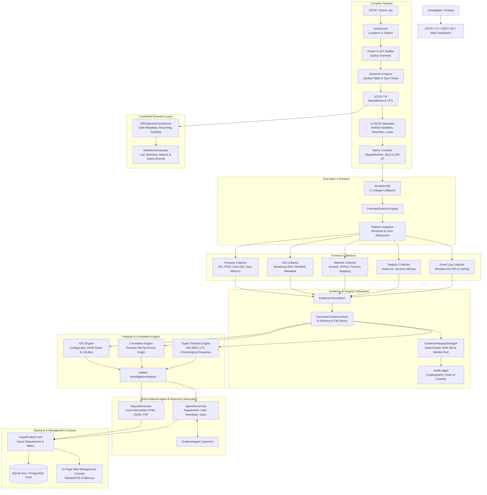

# JOCKY System Architecture

This document describes the complete architecture of the JOCKY Digital Forensics and Incident Response (DFIR) framework across Stages 1 through 12.

---

## 1. High-Level Architecture Diagram

---

## 2. Compiler Pipeline & Native Execution
1. **Source Parsing:** JOCKY source code (`.jky`) is tokenized with source locations by `JockyLexer` and parsed into an Abstract Syntax Tree via Lark's Earley grammar.
2. **Semantic Verification:** `SemanticAnalyzer` validates symbol scopes, entity attributes (e.g. `process.pid`, `network.remote_ip`), and variable type compatibility.
3. **JOCKY IR:** Generates an intermediate representation organized into explicit `BasicBlock` structures with typed registers and control-flow jumps.
4. **LLVM Code Generation:** Translates JOCKY IR into verifiable LLVM IR with real `alloca`, `load`, `store`, conditional branching (`br i1`), and function calls.
5. **Native Execution:** Uses `llvmlite` execution engine for JIT compilation, or `TargetMachine` for `.obj` emission, executing directly through the C-linkage Runtime ABI without AST interpretation.

---

## 3. Evidence Normalization & Cryptographic Integrity
1. **Canonical Evidence Model:** All collector outputs are mapped into `CanonicalEvidenceItem` records with strongly typed schemas (`ProcessEvidence`, `FileEvidence`, `NetworkEvidence`, `EventEvidence`, `RegistryEvidence`).
2. **Deterministic Cryptographic Hashing:** Every item is serialized to a canonical sorted-key JSON string to compute an immutable SHA-256 hash.
3. **Merkle Root & Manifests:** Multiple items are hashed into a Merkle root manifest (`IntegrityManifest`) capable of detecting any data tampering or missing evidence (`VALID`, `MODIFIED`, `CORRUPTED`).
4. **Audit Trail:** Every ingestion, verification, or export action is recorded in `AuditLogger` with cryptographic record digests.

---

## 4. Forensic Analysis Engines
1. **IOC Engine:** Configurable detection engine evaluating JSON-defined rules against evidence items. Flags LOLBin command lines, temporary directory executions, and threat hashes without overclaiming certainty.
2. **Correlation Engine:** Constructs an explicit relationship graph (`EvidenceRelationship`) linking process executions to files on disk, active sockets to process owners, and parent-child process chains. Enforces strict host isolation to eliminate blind cross-host PID joins.
3. **Timeline Engine:** Sequenced super-timeline of events sorted chronologically by ISO-8601 UTC timestamps, explicitly flagging estimated timestamps.

---

## 5. Multi-Endpoint Agent Architecture
1. **Central Server Hub:** Manages endpoint registration, provisions API authentication tokens, monitors agent heartbeats, and orchestrates task dispatch.
2. **Endpoint Agent:** Autonomous client daemon that receives tasks, executes collections, normalizes evidence, generates cryptographic manifests, and submits signed results.
3. **Cryptographic Validation:** Central hub verifies evidence manifests before accepting submissions into the investigation pipeline.

---

## 6. Backend, REST API & Dashboard
1. **Repository Pattern:** Clean abstraction between API endpoints, Async SQLAlchemy repositories, and database engines (SQLite for development, PostgreSQL for production).
2. **Role-Based Access Control (RBAC):** Permissions strictly enforced at the API layer across `ADMIN`, `ANALYST`, and `VIEWER` roles. First-run setup dynamically locks after the initial admin is provisioned.
3. **11-Page Web Management Console:** Complete interface for overview, investigations, endpoints, evidence, IOCs, correlation graphs, timelines, reports, audit logs, system health, and security settings.

---

## 7. Controlled Security-Resilience Research Layer
* Evaluates how safe, non-destructive IR transformations (metadata variation, deterministic register renaming, representation padding) affect security control observations, telemetry event counts, and hash divergence.
* Strictly bounded: zero EDR tampering, zero credential scraping, zero rootkits, and zero destructive capabilities.
